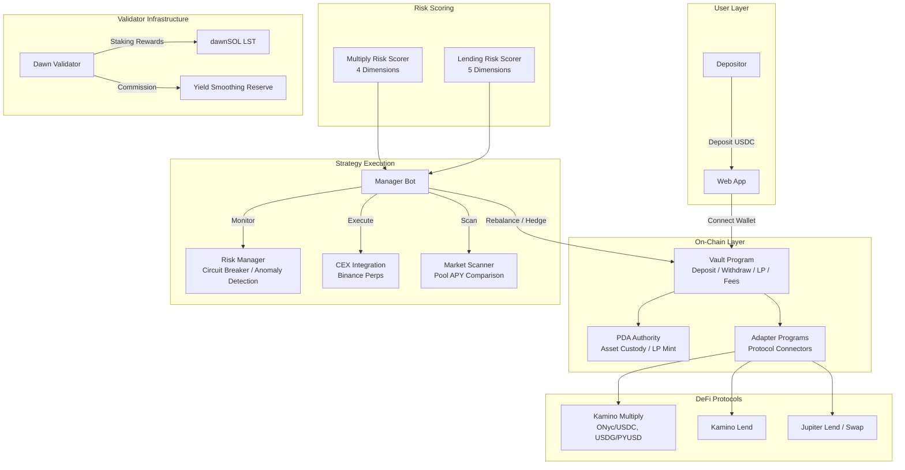

# Dawn Vault Overview

Dawn Vault is a **validator-native yield vault** on Solana, built by Dawn Labs — an active Solana validator operator.

## Concept

Most DeFi yield vaults sit on top of protocols as users. Dawn Vault starts at the infrastructure layer and extends into DeFi:

```
Traditional Vault:    DeFi Protocols → Yield
Dawn Vault:           Validator Infrastructure → DeFi Protocols → Yield
```

Validator revenue provides structural alpha unavailable to pure DeFi aggregators:

- **dawnSOL staking rewards** — The long leg of the delta-neutral strategy earns ~7% staking rewards on top of funding rate income
- **Yield Smoothing Reserve** — Validator commission-derived reserve stabilizes APY during unfavorable market conditions (Phase 2)
- **Skin in the Game** — Dawn Labs' own capital deployed under the same conditions as depositors

## Two-Layer Architecture

Every Dawn Vault follows a **Base Layer + Alpha Layer** design:

```
Vault (Single Entry Point)
  ├── Base Layer   — Always-on, stable yield (Multiply / Lending / Staking)
  └── Alpha Layer  — Conditional, enhanced yield (activated when profitable)
```

The Base Layer ensures depositors always earn yield. The Alpha Layer activates only when market conditions justify the extra complexity.

## Vault Lineup

| | USDC Vault | SOL Vault | BTC Vault |
|---|---|---|---|
| **Base Layer** | Kamino Multiply (primary) + USDC Lending (overflow) | Validator Staking (6-7%) | cbBTC Lending (1-3%) |
| **Alpha Layer** | SOL Delta-Neutral (conditional) | LST Loop (10-20%) | cbBTC collateral → USDC borrow → SOL DN (3.5-11%) |
| **Phase** | **Phase 1 (Active)** | Phase 2 | Phase 3 |

## Why Dawn Vault?

| | Dawn Vault | Traditional Aggregators | Manual Strategies |
|---|---|---|---|
| **Yield Source** | Validator infra + DeFi | DeFi only | DeFi only |
| **Risk Management** | Automated with backtested parameters | Varies | Manual |
| **Transparency** | Full yield decomposition | Limited | N/A |
| **Capital Efficiency** | LST-enhanced (dawnSOL) | Standard | Standard |
| **Downside Protection** | Yield Smoothing Reserve | None | None |

**Japan Gateway** — First Japanese-language Vault on Solana. Existing validator delegator base serves as initial TVL source, with full Japanese UI, reporting, and support.

## System Architecture



### Core Components

| Component | Description |
|-----------|-------------|
| **Vault Program** | On-chain (Voltr SDK): deposits, withdrawals, LP token accounting, fee management, PDA custody |
| **Adapter Programs** | CPI-gated connectors to Kamino (Multiply/Lending) and Jupiter (Lend/Swap). Whitelisted — only approved protocols can access vault assets |
| **Manager Bot** | Off-chain strategy engine: dynamic allocation, market scanning, rebalancing, hedge management, risk monitoring |
| **Risk Scoring** | Multiply Risk Scorer (4-dimension) + Lending Risk Scorer (5-dimension) — see [Risk & Security](risk-and-security.md) |

### Security Model

- **Non-Custodial**: Assets in PDA accounts, not controlled by any individual
- **Permission Separation**: Admin (multisig) vs. Manager (bot) with distinct privileges
- **Adapter Whitelisting**: Only approved adapters can access vault funds
- **Locked Profit**: Yearn V2-style linear release prevents sandwich attacks

Built on the **Voltr** vault framework (Ranger Finance) — battle-tested with multiple vaults in production.

> **Note:** Drift has been excluded due to the 2025 hack. All Drift code paths are `@deprecated`.
