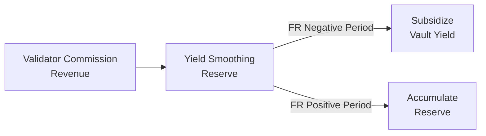

# Transparency

Dawn Vault fully decomposes and discloses the source of every basis point of yield. We believe depositors deserve to know exactly **where their returns come from**.

## Yield Provenance

Many DeFi yield products advertise an APY number without explaining its composition. Dawn Vault provides a full breakdown by source.

### USDC Vault Yield Decomposition

| Component | Source | Typical Range | Risk Level |
|-----------|--------|---------------|------------|
| **Multiply Yield** | Leveraged stablecoin loops via Kamino Multiply (ONyc/USDC, USDG/PYUSD) | 9-16% | Low-Medium |
| **Lending Yield** | Interest from USDC lending (Kamino, Jupiter) | 3-8% | Low |
| **Funding Rate PnL** | Net payments received from SOL-PERP shorts | 8-23% | Medium |
| **Staking Yield** | dawnSOL staking rewards on spot leg | ~7% | Low |
| **Borrowing Cost** | Interest paid on borrowed assets (Multiply borrow leg) | -(0-3%) | N/A |
| **Execution Cost** | Swap slippage, gas fees, position entry/exit costs | -(0.1-0.5%) | N/A |
| **= Net Vault APY** | Sum of all components | **9-30%+** | — |

### Example: Base Layer Only (Current Mode)

```
Multiply Yield:    +14.2%   (ONyc/USDC @ 2.5x, majority allocation)
Lending Yield:      +6.1%   (Kamino USDC, supplementary)
Funding Rate PnL:   +0.0%   (DN strategy inactive)
Execution Cost:     -0.0%   (minimal rebalancing)
─────────────────────────
Net Vault APY:     ~12-16%  (Multiply-dominant)
```

### Example: Base + Alpha (High FR Period)

```
Multiply Yield:    +14.2%   (ONyc/USDC @ 2.5x on 30% allocation)
Lending Yield:      +5.2%   (Kamino USDC on 20% allocation)
Funding Rate PnL:  +18.4%   (SOL FR collection on 50% allocation)
Staking Yield:      +7.1%   (dawnSOL on DN allocation)
Execution Cost:     -0.3%   (swaps, gas)
─────────────────────────
Net Vault APY:     +44.6%   (blended across allocations)
```

> We will never report a blended APY number without providing its full decomposition.

## Proof-Based Reporting

Dawn Vault publishes structured performance reports at regular intervals.

### What We Report

| Data Point | Frequency | Verification |
|-----------|-----------|-------------|
| **Yield Breakdown** (by source) | Every epoch | On-chain transaction data |
| **Hedge Ratio** (spot vs. short) | Every epoch | On-chain + CEX position data |
| **Allocation Split** (base vs. alpha) | Every epoch | On-chain vault state |
| **Reserve Balance** | Every epoch | On-chain account balance |
| **Share Price** | Continuous | On-chain LP token accounting |
| **Cumulative PnL** | Daily | Dashboard + historical data |
| **Drawdown Metrics** | Daily | Calculated from share price history |

### Independent Verification

Depositors can independently verify:

- **Share price**: Query the on-chain vault program directly
- **LP token balance**: Check their wallet
- **Vault TVL**: On-chain total assets visible to anyone
- **Protocol positions**: On-chain adapter positions are public

### Skin in the Game

Dawn Labs deploys its own capital under the **exact same conditions** as depositors — same vault, same strategy, same fee structure. No preferential treatment or separate accounts.

## Yield Smoothing Reserve

The Yield Smoothing Reserve (YSR) is a stabilization mechanism funded by Dawn Labs' validator commission revenue.

### How It Works



1. **Accumulation**: Validator commission revenue flows into the Reserve
2. **Stabilization**: When funding rates turn negative, the Reserve supplements vault yield to reduce APY dips
3. **Recovery**: When conditions improve, the Reserve replenishes

This mechanism is only possible because Dawn Labs operates a Solana validator — the commission revenue is an external income stream that doesn't come from depositor funds.


The Yield Smoothing Reserve is a **stabilization mechanism**, not a guarantee. It does not guarantee any minimum APY, does not insure against losses, and reserve size may be insufficient during prolonged adverse conditions.


The Reserve balance is disclosed in every epoch report. Depositors can track current balance, utilization rate, and accumulation vs. distribution history.
