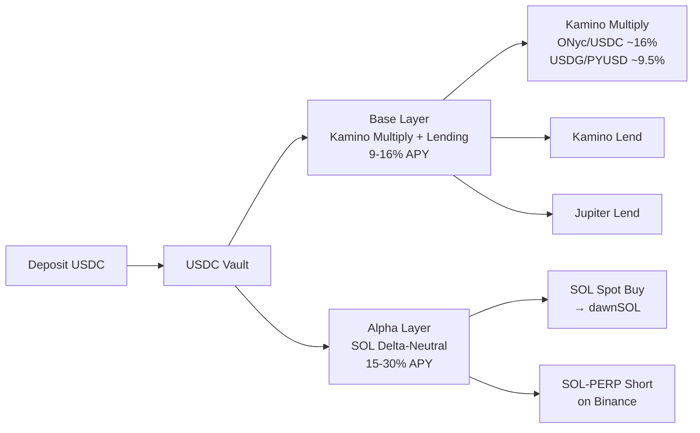

# USDC Vault

**Status: Live (Phase 1)**

The USDC Vault is Dawn Vault's flagship product. Deposit USDC and earn optimized yield through Kamino Multiply, lending aggregation, and delta-neutral strategies — all managed automatically.

## Overview

| Parameter | Value |
|-----------|-------|
| **Deposit Asset** | USDC |
| **Target APY** | 9-16%+ (up to 30%+ during high FR periods) |
| **Base Layer** | Kamino Multiply (primary) + USDC Lending (overflow) |
| **Alpha Layer** | SOL Delta-Neutral (conditional) |
| **Rebalancing** | Daily to weekly |
| **Decision Metric** | Multiply spread + SOL Funding Rate |

## How It Works

### Current Operating Mode (2026-04)

- **Multiply-first allocator:** deployable USDC is routed to Kamino Multiply first. Lending is the overflow and diversification sleeve.
- **DN is dormant:** SOL-PERP funding rates have been negative for an extended period. 100% allocation to Base Layer is correct.
- Full strategy details: [Strategies](strategies.md)

## Performance

### Backtest Results (5.5 Years)

Backtested using Binance SOL/USDT funding rate data from September 2020 to March 2026.

| Metric | Value |
|--------|-------|
| **Annualized Return** | 8.57% |
| **Sharpe Ratio** | 13.41 |
| **Maximum Drawdown** | -0.07% |
| **DN Active Rate** | 23.9% of the time |
| **Cumulative Return** | +57% (vs. +32% lending-only → +25% excess return) |

### Stress Test Results

All five historical stress scenarios passed with maximum drawdown of 0.00%:
- 2022 May (LUNA collapse)
- 2024 August (market crash)
- 2025 October (flash crash)
- Extended negative FR periods
- Rapid FR reversal scenarios

## Risk Management

| Layer | Mechanism | Trigger |
|---|---|---|
| **Circuit Breaker** | Auto-exit from Lending layer | TVL crash (-20%/1h), oracle drift, withdrawal failure |
| **Multiply Risk Scorer** | Separate risk axis for candidate / position scoring | 4 dimensions: depeg risk, liquidation proximity, exit liquidity, reserve pressure |
| **Multiply Risk Policy** | Score-based rebalance rules | < 75 → normal, 75-89 → stop adds + trim, ≥ 90 → full exit |
| **Lending Risk Scorer** | APY penalty adjustment | 5 dimensions: TVL, maturity, utilization, concentration, incidents |
| **Protocol Diversification** | Max 60% allocation cap | Single-protocol lending exposure limit |
| **Multiply Deleverage** | Staged health rate protection | Target 1.15, < 1.10 → soft deleverage (20%), < 1.05 → emergency full deleverage |
| **DN Risk Manager** | FR reversal detection + auto-exit | FR < -10% annualized → immediate close |
| **Guardrails** | Kill switch, SOL balance, price freshness | Prevents tx fee exhaustion and stale data decisions |

For comprehensive risk information, see [Risk & Security](risk-and-security.md).
